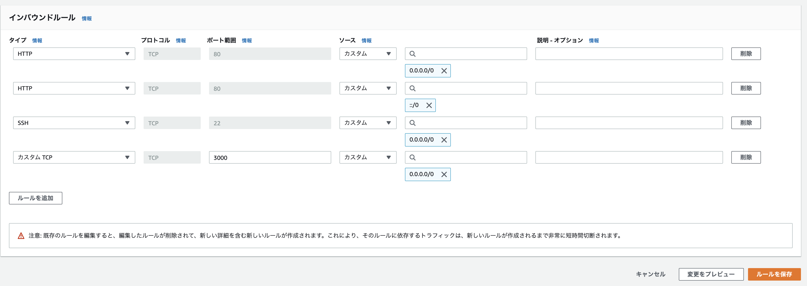

## EC2サーバー構築
## AWSインスタンス作成

  ### リージョンを東京にする

  ### EC2インスタンスを起動する
  - `Amazon Linux AMI 2`を選択する
  - `t2.micro`を選択する
  - キーペアを新規作成し、キーペアのダウンロードをする
  - インスタンスの表示を押す

  ### Elastic IPと紐付ける
  - `Elastic IPアドレスの割り当て`を押す
  - `Amazon の IPv4 アドレスプール`を選択
  - アクションで、`Elastic IPアドレスの関連付け`を選択する
  - インスタンスのプルダウンから、インスタンスidを選択
  - インスタンスの`Elastic IP`を関連付けられてるか確認する

  ### ポートを開く
  - セキュリティーグループを開く
  - インスタンスのセキュリティグループのリンクを開く
  - 該当の`launch-wizard-?`にチェックをいれる
  - 下のインバインドルールを編集をクリックする
  - インバインドルールを下記画像のようにする
    > 
  ### ec2-userでログインする
  - 先ほどダウンロードしたキーペアファイルを任意の場所に作成した`.ssh`ディレクトリの中にいれる
  - ターミナルで作成した`.ssh`ディレクトリに移動して、下記コマンドを実行してパーミッションを600にする
    - `chmod 600 ダウンロードした鍵の名前.pem`
  - パーミッション設定した後に下記コマンドで、ec2-userにログインする
    - `ssh -i ダウンロードした鍵の名前.pem ec2-user@作成したEC2インスタンスと紐付けたElastic IP`
  - プロンプトが`[ec2-user@ip-172-31-39-245 ~]$`になるとログイン成功

## サーバー環境構築
  ### 設定用ツールのパッケージをインストールする
  ```
    [ec2-user@ip-172-31-25-189 ~] sudo yum -y update
    [ec2-user@ip-172-31-25-189 ~] sudo yum -y install git make gcc-c++ patch libyaml-devel libffi-devel libicu-devel zlib-devel readline-devel libxml2-devel libxslt-devel ImageMagick ImageMagick-devel openssl-devel libcurl libcurl-devel curl
  ```
  ### Node.jsをインストールする
  ```
  [ec2-user@ip-172-31-25-189 ~] sudo curl -sL https://rpm.nodesource.com/setup_10.x | sudo bash -
  [ec2-user@ip-172-31-25-189 ~] sudo yum -y install nodejs
  ```
  ### yarnをインストールする
  ```shell
  [ec2-user@ip-172-31-25-189 ~]$ sudo yum -y install wget
  [ec2-user@ip-172-31-25-189 ~]$ sudo wget https://dl.yarnpkg.com/rpm/yarn.repo -O /etc/yum.repos.d/yarn.repo
  [ec2-user@ip-172-31-25-189 ~]$ sudo yum -y install yarn
  ```
  ### rbenvとruby-buildをインストールする
  ```shell
    #rbenvのインストール
    [ec2-user@ip-172-31-25-189 ~]$ git clone https://github.com/sstephenson/rbenv.git ~/.rbenv
    #パスを通す
    [ec2-user@ip-172-31-25-189 ~]$ echo 'export PATH="$HOME/.rbenv/bin:$PATH"' >> ~/.bash_profile
    #rbenvを呼び出すための記述
    [ec2-user@ip-172-31-25-189 ~]$ echo 'eval "$(rbenv init -)"' >> ~/.bash_profile
    #.bash_profileの読み込み
    [ec2-user@ip-172-31-25-189 ~]$ source .bash_profile
    #ruby-buildのインストール
    [ec2-user@ip-172-31-25-189 ~]$ git clone https://github.com/sstephenson/ruby-build.git ~/.rbenv/plugins/ruby-build
    #rehashを行う
    [ec2-user@ip-172-31-25-189 ~]$ rbenv rehash
  ```
  ### Rubyをインストールする
  ```shell
    [ec2-user@ip-172-31-25-189 ~]$ rbenv install 2.6.5
    [ec2-user@ip-172-31-25-189 ~]$ rbenv global 2.6.5
    [ec2-user@ip-172-31-25-189 ~]$ rbenv rehash  #rehashを行う
    [ec2-user@ip-172-31-25-189 ~]$ ruby -v # バージョンを確認
  ```
  ### MariaDBをインストールする
  - `[ec2-user@ip-172-31-25-189 ~]$ sudo yum -y install mysql56-server mysql56-devel mysql56 mariadb-server mysql-devel`
  ### MariaDBを起動する
  - `[ec2-user@ip-172-31-25-189 ~]$ sudo systemctl start mariadb`
  - MariaDBが起動してるか確認する
  ```shell
    [ec2-user@ip-172-31-25-189 ~]$ sudo systemctl status mariadb

    ● mariadb.service - MariaDB database server
      Loaded: loaded (/usr/lib/systemd/system/mariadb.service; disabled; vendor preset: disabled)
      Active: active (running) since 土 2020-02-29 07:00:11 UTC; 7s ago
      Process: 5993 ExecStartPost=/usr/libexec/mariadb-wait-ready $MAINPID (code=exited, status=0/SUCCESS)
      Process: 5957 ExecStartPre=/usr/libexec/mariadb-prepare-db-dir %n (code=exited, status=0/SUCCESS)
  ```
  ### rootパスワードの設定
    - `[ec2-user@ip-172-31-25-189 ~]$ sudo /usr/bin/mysql_secure_installation`
    - パスワードを入力する表示が出たら、入力して他は全てYで回答する
    - mysqlにログインできるか`mysql -uroot -p`で確認する
  ### EC2のキーペアを作成する
  - `[ec2-user@ip-172-31-25-189 ~]$ ssh-keygen -t rsa -b 4096`
  - 公開鍵を表示させる

  ```shell
    [ec2-user@ip-172-31-39-245 ~]$ cat ~/.ssh/id_rsa.pub
    ssh-rsa AAAAB3NzaC1yc2EAAAADAQABAAACAQC5DcrroBbtEUnSiNrsRFzBE9HcmxmEr7EHdOKoIPq0DPTf06PINGjy1KW7Biu3FwOntimR79RjgbpdAAQdIKURWTtkws5TY6WiH8HDkwWfEEJICF1py/NTVDkNqPyDV0N+imYTn+B/yGOCmGPUat8lA6gxyVw9H0fcsYyqGTJQL6BVV1tBVmMNcmwp56nRR70Ooujs+k7gbh3NqT/GwrGErv58CRKmMrHNnaT025C6IR+GTBTUo64P4kvROE7XHFWpdry0mLhxM2dpoGRaaVCL9YZMx4SwNrjuNwsoasMTixof9UxX9x9lJztBXcl74EowLgycCk91IeCUQ7uQhrTBhK0aK43Z/MQJus9RytMdyQE/yn/7rnezKyfSlW/5UF3Kmp4BpiscxkR0AjHOdElz0wO51X6kJaKpiC6uCEQOYOzgefwPvKXgtdoppe68WjSBt4a+V0tJ73AlYuW2egIasqX7nxPbuxUVh/uRqrJuNIrJf56bhFdXA9b+MtLdrQzLqhz/hxbO84JyANDm34dpMQbwW6nY5EzdW6jRvpPf4AwViVIu+/txr3PVu+1tB4UE1A9sRjw5aeapWYyM7/le3GaRANgAM9Zo4Xv8gc6kLY5P7f7RMWQFl2n7uBWZvpFO2/mVFIn0BQ59V1WssKIcQLhRmuX1Yf7Lq52zkiKR2Q== ec2-user@ip-172-31-39-245.ap-northeast-1.compute.internal
  ```
  - [公開鍵をGitHubkeyに登録する](https://github.com/settings/keys)
  ### Unicornをインストールする
  - gemfileに追記して`bundle install`する
  ```gemfile
    group :production do
      gem 'unicorn', '5.4.1'
    end
  ```
  - `config/unicorn.rb`を作成して下記を記載する
  ```ruby
    #サーバ上でのアプリケーションコードが設置されているディレクトリを変数に入れておく
    app_path = File.expand_path('../../', __FILE__)

    #アプリケーションサーバの性能を決定する
    worker_processes 1

    #アプリケーションの設置されているディレクトリを指定
    working_directory app_path

    #Unicornの起動に必要なファイルの設置場所を指定
    pid "#{app_path}/tmp/pids/unicorn.pid"

    #ポート番号を指定
    listen 3000

    #エラーのログを記録するファイルを指定
    stderr_path "#{app_path}/log/unicorn.stderr.log"

    #通常のログを記録するファイルを指定
    stdout_path "#{app_path}/log/unicorn.stdout.log"

    #Railsアプリケーションの応答を待つ上限時間を設定
    timeout 60

    #以下は応用的な設定なので説明は割愛

    preload_app true
    GC.respond_to?(:copy_on_write_friendly=) && GC.copy_on_write_friendly = true

    check_client_connection false

    run_once = true

    before_fork do |server, worker|
      defined?(ActiveRecord::Base) &&
        ActiveRecord::Base.connection.disconnect!

      if run_once
        run_once = false # prevent from firing again
      end

      old_pid = "#{server.config[:pid]}.oldbin"
      if File.exist?(old_pid) && server.pid != old_pid
        begin
          sig = (worker.nr + 1) >= server.worker_processes ? :QUIT : :TTOU
          Process.kill(sig, File.read(old_pid).to_i)
        rescue Errno::ENOENT, Errno::ESRCH => e
          logger.error e
        end
      end
    end

    after_fork do |_server, _worker|
      defined?(ActiveRecord::Base) && ActiveRecord::Base.establish_connection
    end
  ```
  ### gitクローンする
    - 権限を変更する
    ``` shell
      #mkdirコマンドで新たにディレクトリを作成
      [ec2-user@ip-172-31-23-189 ~]$ sudo mkdir /var/www/
      #作成したwwwディレクトリの権限をec2-userに変更
      [ec2-user@ip-172-31-23-189 ~]$ sudo chown ec2-user /var/www/
    ```
  - クローンする
  ```shell
    [ec2-user@ip-172-31-23-189 ~]$ cd /var/www/
    [ec2-user@ip-172-31-23-189 www]$ git clone https://github.com/<ユーザー名>/<リポジトリ名>.git
  ```
### Swap領域を用意する
- `cd`でホームディレクトリに移動する
- Swap領域を確保する
  ```shell
    #処理に時間がかかる可能性があるコマンドです
    [ec2-user@ip-172-31-25-189 ~]$ sudo dd if=/dev/zero of=/swapfile1 bs=1M count=512
    # しばらく待って、以下のように表示されれば成功
    512+0 レコード入力
    512+0 レコード出力
    536870912 バイト (537 MB) コピーされました、 7.35077 秒、 73.0 MB/秒
    [ec2-user@ip-172-31-25-189 ~]$ sudo chmod 600 /swapfile1
    [ec2-user@ip-172-31-25-189 ~]$ sudo mkswap /swapfile1
    # 以下のように表示されれば成功
    スワップ空間バージョン1を設定します、サイズ = 524284 KiB
    ラベルはありません, UUID=74a961ba-7a33-4c18-b1cd-9779bcda8ab1
    [ec2-user@ip-172-31-25-189 ~]$ sudo swapon /swapfile1
    [ec2-user@ip-172-31-25-189 ~]$ sudo sh -c 'echo "/swapfile1  none        swap    sw              0   0" >> /etc/fstab'
  ```

### gemをインストールする
  - `[ec2-user@ip-172-31-23-189 www]$ cd  /var/www/<リポジトリ名>`で移動してrubyのバージョンを確認する
  - ローカルのbundlerのバージョンを確認する
  - EC2にローカルと同じバージョンのbundlerをインストールする
  ```shell
    [ec2-user@ip-172-31-23-189 <リポジトリ名>]$ gem install bundler -v 2.1.4
    # ローカルで確認したbundlerのバージョンを導入する
    [ec2-user@ip-172-31-23-189 <リポジトリ名>]$ bundle install
    # 上記コマンドは、数分以上かかる場合もあります。
  ```

### 環境変数の設定をする
  - secret_key_baseを作成する
  ```shell
    [ec2-user@ip-172-31-23-189 <リポジトリ名>]$ rake secret
    eb5c31d413f17707ee0b2e269c27b4a44aa62771d9c199a0357087f0f9eed28538c4f5a4e4487b7c43bbabda8422115cc277d41291e5d7119f128cf8429bc966
  ```
  - 環境変数を記載する
  ```vim
    [ec2-user@ip-172-31-23-189 ~]$ sudo vim /etc/environment
    DATABASE_PASSWORD='データベースのrootユーザーのパスワード'
    SECRET_KEY_BASE='先程コピーしたsecret_key_base'
  ```
  - 記載したら反映するために再起動する`exit`→`ssh -i [ダウンロードした鍵の名前].pem ec2-user@[作成したEC2インスタンスと紐付けたElastic IP]（ダウンロードした鍵を用いて、ec2-userとしてログイン）`

### Railsを起動させる

- ユニコーンを起動する
  ```shell
  [ec2-user@ip-172-31-23-189 ~]$ cd /var/www/[リポジトリ]
  [ec2-user@ip-172-31-23-189 <リポジトリ名>]$ bundle exec unicorn_rails -c config/unicorn.rb -E production -D
  master failed to start, check stderr log for details
  ```

- database.ymlの本番環境の設定を編集
  ```yml
    production:
      <<: *default
      database: ~~~（それぞれのアプリケーション名によって異なっています。こちらは編集しないでください）
      username: root
      password: <%= ENV['DATABASE_PASSWORD'] %>
      socket: /var/lib/mysql/mysql.sock
  ```

- git pullする
  ```shell
  [ec2-user@ip-172-31-23-189 <リポジトリ名>] git pull origin master
  ```

- db:create, db:migrateをする
```shell
  [ec2-user@ip-172-31-23-189 <リポジトリ名>]$ rails db:create RAILS_ENV=production
  Created database '<データベース名>'
  [ec2-user@ip-172-31-23-189 <リポジトリ名>]$ rails db:migrate RAILS_ENV=production
```
> もしここでMysql2::Error: Can't connect to local MySQL server through socket '/var/lib/mysql/mysql.sock'というエラーが起こった場合、データベースが起動していない可能性があります。sudo systemctl start mariadbというコマンドをターミナルから打ち込み、mysqlの起動を試してみましょう。

- アセットコンパイルする
  ```shell
    [ec2-user@ip-172-31-23-189 <リポジトリ名>]$ rails assets:precompile RAILS_ENV=production
  ```

- ps コマンドでUnicornのプロセスを確認する
  ```shell
    [ec2-user@ip-172-31-23-189 <リポジトリ名>]$ ps aux | grep unicorn
    ec2-user 17877  0.4 18.1 588472 182840 ?       Sl   01:55   0:02 unicorn_rails master -c config/unicorn.rb -E production -D
    ec2-user 17881  0.0 17.3 589088 175164 ?       Sl   01:55   0:00 unicorn_rails worker[0] -c config/unicorn.rb -E production -D
    ec2-user 17911  0.0  0.2 110532  2180 pts/0    S+   02:05   0:00 grep --color=auto unicorn
  ```

- pid killする
  ```shell
    ec2-user 17877  0.4 18.1 588472 182840 ?       Sl   01:55   0:02 unicorn_rails master -c config/unicorn.rb -E production -D
    ec2-user 17881  0.0 17.3 589088 175164 ?       Sl   01:55   0:00 unicorn_rails worker[0] -c config/unicorn.rb -E production -D
    ec2-user 17911  0.0  0.2 110532  2180 pts/0    S+   02:05   0:00 grep --color=auto unicorn
    [ec2-user@ip-172-31-23-189 <リポジトリ名>]$ kill <確認したunicorn rails masterのPID>
    [ec2-user@ip-172-31-23-189 <リポジトリ名>]$ ps aux | grep unicorn # 確認する
  ```

- unicornを再起動する
```shell
  RAILS_SERVE_STATIC_FILES=1 unicorn_rails -c config/unicorn.rb -E production -D
```

- ログの確認コマンド
```shell
[ec2-user@ip-172-31-23-189 <リポジトリ名>]$tail -f log/production.log
```


## resetからのseedコマンド
```ec2
[ec2-user@******* current]$ RAILS_ENV=production DISABLE_DATABASE_ENVIRONMENT_CHECK=1 bundle exec rake db:drop
[ec2-user@******* current]$ rake db:create RAILS_ENV=production
[ec2-user@******* current]$ rake db:migrate RAILS_ENV=production
[ec2-user@******* current]$ rake db:seed RAILS_ENV=production
```

```
ps aux | grep unicorn
kill `<id>`
bundle exec cap production deploy
```
