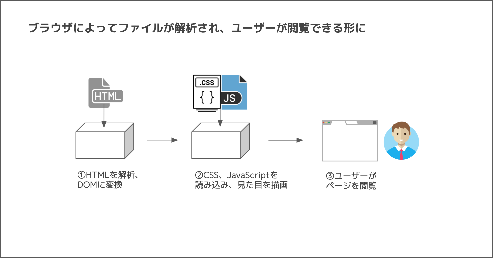
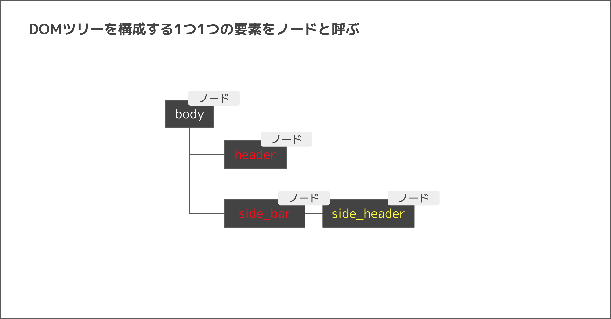

# DOM
  > Document Object Model(ドキュメントオブジェクトモデル)
  - HTMLを解析して、データを作成する仕組み

- `document.getElementById("id名");`
  `document`は、webページのDOMツリーが入っているオブジェクト
  DOMツリーから特定の要素を取得するためのメソッド

- `document.getElementsByClassName("class名");`
  `class`を指定して特定の要素を取得するためのメソッド
  違いは`Elements`と複数形になっていること
  idはHTML上に1つしか存在しないのに対してクラス名を指定する場合は同じクラスを持つ要素全て取得することが可能

- `document.querySelector("セレクタ名");`
  指定したセレクタに合致するもののうち一番最初に見つかった要素1つを取得する

- `(ノードオブジェクト).addEventListener("イベント名", 関数);`
  記述以降のノードオブジェクトにイベントが起きた時、関数を実行するメソッド
  イベントと関数を紐付けることを**イベントリスナ**と呼ぶ。

- `window.onload = function() { 処理 };`
  ページの読み込みが終わるイベントに対応する

- `window.addEventListener('load', function() { 処理 });`
  windowのloadイベント(ページの読み込み)が起きたら関数が実行される
