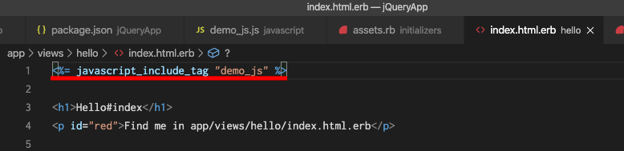

(2020/06/04)
ruby var : 2.7.1
rails var: 6.0.3.1
# jQuery導入方法

[参照記事](https://bcibrainwaveeeg.com/jquery-include-for-rails/)


- jQueryを追加するアプリケーションのディレクトリに移動して`yarn add jquery`を実行し、jQueryをRailsに読み込む
  
<br>

- jQueryが導入出来ているか下記ファイルで確認する
  1. **yarn.lock**
  2. **package.json**
  
  
<br>


<br>

- **app/javascript/packs/application.js**に`require("jquery")`を追加する
  
<br>

- **config/webpack/environment.js**に下記コードを記述する
  ```js
    const webpack = require('webpack')
    environment.plugins.prepend('Provide',
      new webpack.ProvidePlugin({
      $: 'jquery/src/jquery',
      jQuery: 'jquery/src/jquery'
    })
    )
  ```
  

---

### これでjQueryの準備は完了、次はviewに反映させる

- **app/assets**に**javascript**フォルダを追加して**jacascript**フォルダ内に**ファイル名.js**を作成しjsコードを記述する。
  
<br>

- 任意のviewファイルに下記コードを追加する、ファイル名は**app/assets/javascript/ファイル名.js**のファイル名だけを記述する
  ```erb
    <%= javascript_include_tag 'ファイル名' %>
  ```
  
<br>

- **config/initializers/assets.rb**に下記コードを追加する

  ```ruby
    Rails.application.config.assets.precompile += %w( ファイル名.js )
  ```
  

## 反映後↓
  


## Ajaxメソッド

|オプション|説明|
|:-----|:--|
|type|HTTP通信の種類を記述する。通信方法は、GETとPOSTの2種類がある。|
|url|リクエストを送信する先のURLを記述する。|
|data|サーバに送信する値を記述する。|
|dataType|サーバから返されるデータの型を指定する。|
|processData|dataに指定したオブジェクトをクエリ文字列に変換する役割、初期値はtrue 変換しない場合はfalse|
|contentType|サーバにデータのファイル形式を伝えるヘッダー。デフォルトでは`application/x-www-form-urlencoded; charset=UTF-8`<br>FormDataでデータを受け取る場合はFromDataが自動的にデータ方を変更してくれるため、変更したくない場合にfalseとする[Formdata公式リファレンス](https://developer.mozilla.org/ja/docs/Web/Guide/Using_FormData_Objects?redirectlocale=ja&redirectslug=DOM%2FXMLHttpRequest%2FFormData%2FUsing_FormData_Objects)|

## jbuilder
  RailsAppを生成した際にデフォルトで入っているgemで、入力データをjson形式で出力するテンプレートエンジン

  ### jbilderファイルの作成方法
  対応するコントローラのアクションに対して作成する必要があるため、
  ファイルの場所とファイル名は`app/views/コントローラ名/アクション名.json.jbuilder`で作成する
  **ファイルの中身**
  > key valueのような形式で呼び出すことができるため、複雑なjsonより見やすくなる

  ```ruby
  json.key @インスタンス変数.カラム名 # 受け取りたいデータを代入する？
  json.key @インスタンス変数.カラム名
  json.key @インスタンス変数.カラム名
  ```
  > アクションで定義したインスタンス変数をvalueとして、keyと紐付けるイメージと思う.
  > keyはなんでもいいがわかりやすい表記で記載する
  > 表示させたい情報をkeyと紐付ける


- 403error
  urlのエラー
  ajaxのurlを確認する
- 500error
  サーバーサイド側のエラー
  controller, jbuilderを確認する
